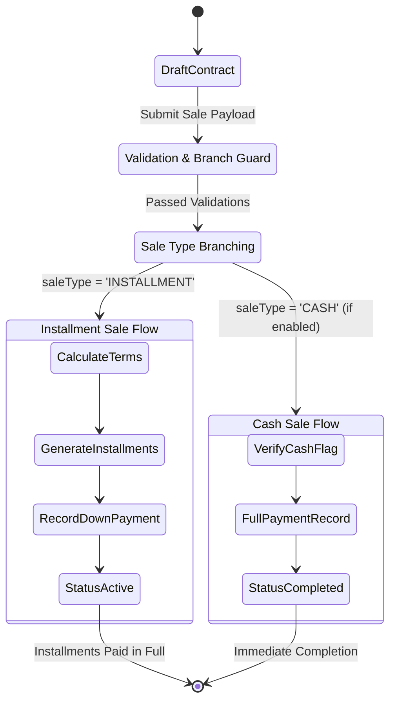

# System Architecture & Technical Design (Java Spring Boot)

This document describes the architectural principles, data flow, multi-branch isolation design, and database portability models powering **Murabha Cloud (Java Spring Boot Edition)**.

---

## 🏛️ High-Level Topology

```
                  ┌─────────────────────────────────┐
                  │   Web Browser Client / SPA UI   │
                  │ (React 18 + Vite + Tailwind CSS)│
                  │      Port: 2436 (Dev) / 80      │
                  └────────────────┬────────────────┘
                                   │ HTTPS / REST API
                                   ▼
                  ┌─────────────────────────────────┐
                  │    Nginx Reverse Proxy & Edge   │
                  │   Static Assets + SSL + /api/   │
                  └────────────────┬────────────────┘
                                   │ HTTP
                                   ▼
                  ┌─────────────────────────────────┐
                  │   Java Spring Boot 3.3.4 API    │
                  │  ├── Bucket4j Rate Limiting     │
                  │  ├── Spring Security 6 & JJWT   │
                  │  ├── BranchScopeFilter (BOLA)   │
                  │  ├── Audit Logging Interceptor  │
                  │  ├── Global @ControllerAdvice   │
                  │  └── Spring Data JPA / Hibernate│
                  └────────┬───────────────┬────────┘
                           │               │
                           ▼               ▼
                 ┌────────────────┐ ┌────────────────┐
                 │   PostgreSQL   │ │ Oracle Database│
                 │ Staging/Cloud  │ │ Enterprise DB  │
                 └────────────────┘ └────────────────┘
```

---

## 🏢 Multi-Tenant Branch Scoping & Anti-BOLA/IDOR Design

When handling financial records and customer debt, cross-tenant leaks are unacceptable. Murabha Cloud approaches branch isolation defensively:

### 1. Data-Level Scoping
Every operational record belongs strictly to a branch:
- `Customer.branchId`
- `MachineSale.branchId`
- `Installment.branchId`
- `Payment.branchId`
- `FollowUp.branchId`

Foreign key constraints prevent any orphaned or branch-less operational records.

### 2. Request Interception & Guardrails (`BranchScopeFilter.java`)
Isolation is enforced centrally in the servlet filter chain before requests hit Spring `@RestController` endpoints:
- The user's authenticated token carries their designated `branchId` and `role`.
- **For Branch Users** (`BRANCH_MANAGER`, `BRANCH_COLLECTOR`, `BRANCH_DATA_ENTRY`):
  - The servlet filter automatically locks the active thread context to `user.branchId`.
  - **Tampering Defense**: If a malicious client attaches a header (e.g., `x-branch-id: other-branch`) or query parameter aiming to access another branch's assets, the filter flags an unauthorized attempt and halts the request immediately with `403 Forbidden`.
- **For HQ Executives** (`SUPER_ADMIN`, `HQ_MANAGER`, `HQ_ACCOUNTANT`):
  - These roles are permitted to supply `x-branch-id` to filter views for a specific branch, or omit it to query aggregated data across all company branches.

---

## ⚙️ Dynamic System Configuration & Feature Toggles

To support flexible operational models across diverse business units, Murabha Cloud implements dynamic database-backed feature configuration:
- **Entity**: `SystemSetting` (`key: varchar(64) PK`, `value: text`, `updatedAt: timestamp`).
- **REST Endpoints**:
  - `GET /api/settings`: Returns a key-value dictionary of all active system flags.
  - `PUT /api/settings/{key}`: Atomic updates restricted to `SUPER_ADMIN` and `HQ_MANAGER`.

### Feature Flag: Configurable Cash Sales (`enableCashSales`)
- When `enableCashSales = "true"`, the platform activates cash sale registration without forcing artificial installment generation.
- When `enableCashSales = "false"`, sales creation requires valid down payment and installment duration terms.

---

## 💳 The Sales Lifecycle: Installments vs. Cash Contracts



---

## 📊 Legacy Excel Ingestion Pipeline (Apache POI)

The spreadsheet ingestion subsystem processes high-volume legacy customer and contract records with zero data corruption:

1. **Header Normalization & Arabic Support**:
   - Detects standard and dialectal Arabic column headers (`اسم العميل`, `رقم الماكينة`, `اجمالي العقد`, `المسدد`, etc.).
2. **Date Parser Engine**:
   - Handles mixed format strings (`YYYY-MM-DD`, `DD/MM/YYYY`) and native Excel serial dates.
   - Bounds-checked strictly between **2000-01-01** and **2050-12-31** to prevent corrupt or overflow dates.
3. **Financial Sanity & Rounding Tolerance**:
   - Guards against negative numbers and division by zero using `BigDecimal`.
   - Implements a configurable **5.0 EGP tolerance threshold** to smoothly accommodate historical penny rounding discrepancies.
4. **Collision-Safe Receipt Generation**:
   - Generates unique deterministic receipt indices:
     - Down payment receipt: `R-IMP-{saleId}-0`
     - Historical installment receipts: `R-IMP-{saleId}-{installmentNumber}`
   - Guarantees zero primary key / receipt collision even when importing large multi-sheet workbooks.
5. **Atomic FIFO Settlement**:
   - Distributes cumulative paid amounts (`المسدد`) across generated installments in chronological order, automatically tagging fully paid vs. partially paid debts.

---

## 🔄 The Multi-Database Strategy: H2, PostgreSQL & Oracle

Enterprise organizations often mandate Oracle Database, while fast-paced engineering teams prefer PostgreSQL or embedded H2 for local workflows and CI testing. Murabha Cloud embraces all three without compromises:

### 1. Unified Entity Layer via Spring Data JPA & Hibernate 6
All models are declared with ANSI SQL and JPA annotations:
- Portable column definitions (`UUID`, `VARCHAR`, `NUMERIC(12,2)`, `TIMESTAMP WITH TIME ZONE`).
- Precision-safe currency handling using `java.math.BigDecimal`, preventing IEEE 754 floating-point rounding errors.

### 2. High-Performance JDBC Drivers
- **H2**: Zero-setup in-memory database with PostgreSQL dialect compatibility for lightning-fast unit tests and offline development.
- **PostgreSQL**: Production-grade cloud database driver (`org.postgresql:postgresql`).
- **Oracle Database**: Official Oracle JDBC driver (`com.oracle.database.jdbc:ojdbc11`) supporting Thin Mode directly over TCP/IP without requiring native C client libraries.

### 3. Automated In-App Migration Architecture
The built-in **Oracle Migration Wizard** executes an automated 4-step migration:
1. **Connectivity Probe**: Validates network reachability, user credentials, service name, and Oracle engine version.
2. **Schema Provisioning (Auto DDL)**: Creates tables, primary keys, foreign keys, unique indices, and check constraints tailored for Oracle syntax.
3. **Chunked Pipeline Streaming**: Reads records from PostgreSQL and streams them in transactions to Oracle Database, preserving ID parity across relations.
4. **Double-Entry Financial Audit**: Runs side-by-side reconciliation queries comparing total sales, total installment dues, and total collected payments between both engines to certify 100% financial integrity before switching.

---

## 🔐 Session Management & Auditing

- **Access Tokens**: Short-lived (15 minutes) signed with HMAC-SHA256 via JJWT. Carried in the `Authorization: Bearer <token>` header.
- **Refresh Tokens**: Long-lived (7 days) stored exclusively in `HttpOnly, SameSite=Strict, Secure` cookies to mitigate XSS-based token theft.
- **Audit Logging**: Every privileged or state-changing action is captured into the `AuditLog` table, recording:
  - Timestamp
  - User ID and username
  - Action identifier (`USER_SUSPEND`, `BRANCH_CREATE`, `DB_RESET`, etc.)
  - Client IP address and User-Agent
  - Structured JSON metadata capturing before/after values.