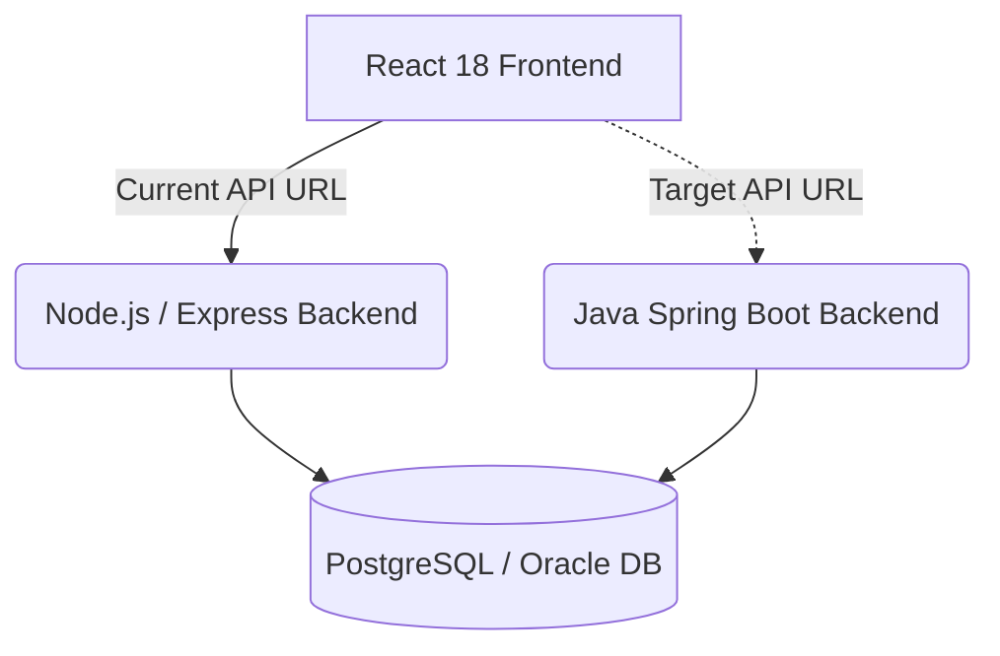

# Master Migration Plan: Murabha Cloud

## Executive Summary

This document outlines the strategic migration of the **Murabha Cloud (مرابحة كلاود)** installment sales management platform backend from Node.js to Java Spring Boot. The objective is to replace the current Node.js, Express, and TypeScript infrastructure with an enterprise-grade Java 21 and Spring Boot 3.x architecture, establishing a foundation for increased scalability, maintainability, and robust type safety.

- **Current State:** Node.js + Express + TypeScript + Prisma (SQLite) + TypeORM (PostgreSQL/Oracle) backend
- **Target State:** Java 21 + Spring Boot 3.3.x + Spring Data JPA + Hibernate
- **Frontend Impact:** Zero. The frontend (React 18 + Vite + Tailwind CSS) will remain completely untouched. Only the backend is changing.
- **Project Name:** Murabha Cloud (مرابحة كلاود)

## Current Architecture Overview

The existing application operates as a monorepo consisting of a `frontend/` (React SPA) and a `backend/` (Express API) directory. Key backend characteristics include:

- **Dual ORM Setup:** Prisma for local SQLite development and TypeORM for PostgreSQL/Oracle cloud deployments.
- **Authentication:** JWT access tokens (15-minute expiry) with HttpOnly refresh cookies, password hashing via bcryptjs.
- **Multi-tenancy:** Branch isolation enforced via a `branchId` column and a `branchScopeMiddleware`.
- **Role-Based Access Control (RBAC):** 6 distinct roles: `SUPER_ADMIN`, `HQ_MANAGER`, `HQ_ACCOUNTANT`, `BRANCH_MANAGER`, `BRANCH_COLLECTOR`, `BRANCH_DATA_ENTRY`.
- **Database:** Support for SQLite (dev), PostgreSQL (prod), and Oracle (enterprise), utilizing runtime migrations in a custom `migrator.ts`.
- **Key Libraries:** `exceljs`/`xlsx` (Excel operations), `multer` (file uploads), `zod` (validation), `helmet`/`express-rate-limit` (security), `date-fns` (date manipulation), `otplib` (TOTP MFA).

## Target Architecture (Spring Boot)

The new backend will map existing capabilities to enterprise Java standards:

- **Core Framework:** Java 21 LTS + Spring Boot 3.3.x
- **Security:** Spring Security 6 implementing JWT + HttpOnly refresh cookies
- **Data Access:** Spring Data JPA + Hibernate 6, supporting multi-database configurations (H2 for dev, PostgreSQL for prod, Oracle for enterprise)
- **Database Migrations:** Flyway
- **DTO Mapping:** MapStruct
- **Validation:** Jakarta Bean Validation (replacing Zod)
- **Excel Processing:** Apache POI (replacing exceljs/xlsx)
- **Templating:** Thymeleaf (replacing inline HTML templates for receipts and contracts)
- **Observability:** Spring Boot Actuator (replacing basic `/health` endpoints)
- **Rate Limiting:** Bucket4j or Spring Rate Limiter (replacing express-rate-limit)
- **Build System:** Maven multi-module or single module with specific environment profiles

## Migration Strategy

This migration will utilize the **Parallel Replacement** strategy (rather than a Strangler Fig approach). 

- The entire Spring Boot backend will be developed alongside the existing Node.js backend.
- Both backends will expose the **exact same API contract** (routes, payloads, status codes).
- The React frontend will switch between backends by simply updating the API Base URL.
- Validation will occur by running both backends against the identical PostgreSQL database to ensure data integrity and behavioral parity.
- Final cutover will occur only when all endpoints pass comprehensive contract and integration testing.

## Phase Breakdown

The migration is divided into sequential phases, estimating 13 weeks for a single developer or 8 weeks for a two-person team.

### Phase 0: Project Scaffolding & Infrastructure (Week 1)
- [ ] Spring Boot project initialization via Spring Initializr.
- [ ] Maven/Gradle configuration with all required dependencies.
- [ ] Docker Compose update (add `backend-java` service alongside `backend-node`).
- [ ] CI/CD pipeline setup for Maven build and tests.
- [ ] Database connection configuration mapping H2, PostgreSQL, and Oracle profiles.

### Phase 1: Data Layer & Security Foundation (Weeks 2-3)
- [ ] JPA Entity classes mapping current models exactly:
  - Customer, MachineSale, Installment, Payment, FollowUp (historically Prisma)
  - Branch, User, AuditLog (historically TypeORM)
  - SystemSetting
- [ ] Spring Data JPA Repositories for data access.
- [ ] Flyway migrations translation (from Prisma schema and `migrator.ts` raw SQL).
- [ ] Spring Security configuration: JWT authentication filter, refresh token cookie handling, RBAC setup.
- [ ] Branch scope filter (replacing `branchScopeMiddleware`).
- [ ] Audit interceptor (replacing `auditService`).

### Phase 2: Core Business Services (Weeks 4-6)
- [ ] `CustomerService`: Implement CRUD and branch-scoped queries.
- [ ] `SaleService`: Implement installment generation, payment allocation (FIFO), void/recalculate logic.
- [ ] `InstallmentService`: Batch updates, overdue queries, penalty calculations.
- [ ] `PaymentService`: Void and replay logic, transaction tracking.
- [ ] `FollowUpService`: Note tracking and status updates.
- [ ] `DashboardService` & `HQDashboardService`: Aggregation and statistical queries.

### Phase 3: REST Controllers & API Parity (Weeks 7-8)
- [ ] Map ALL existing Express routes to Spring `@RestController` classes.
- [ ] Guarantee identical URL paths, headers, and request/response JSON shapes.
- [ ] File upload endpoints migration (using `MultipartFile` replacing `multer`).
- [ ] Excel import/export endpoints routing.
- [ ] Branch configuration endpoints.

### Phase 4: Reports, Analytics & Export (Weeks 9-10)
- [ ] `ReportService`: Sales, collections, overdue, month-closing, collection-ratio, customer statement logic.
- [ ] `AnalyticsService`: KPIs, payment channels, overdue risk, cashflow forecast, top defaulters logic.
- [ ] `ExportService`: Excel workbooks generation using Apache POI, HTML receipts/contracts generation with Thymeleaf.
- [ ] Monthly export generation with SHA-256 integrity hashes.

### Phase 5: Admin, Settings & Migration Tools (Week 11)
- [ ] Admin users CRUD and RBAC assignment.
- [ ] Branches management endpoints.
- [ ] System settings management.
- [ ] Oracle migration wizard endpoints.
- [ ] Database backup/restore endpoints.
- [ ] Database reset protected by TOTP MFA.
- [ ] Excel bulk import functionalities.

### Phase 6: Integration Testing, UAT & Cutover (Weeks 12-13)
- [ ] Contract testing: Assure every endpoint returns identical JSON compared to the Node.js version.
- [ ] Load testing and performance profiling.
- [ ] Security audit (JWT expiry, RBAC enforcement, SQL injection prevention).
- [ ] Data migration validation using parallel run tests.
- [ ] Frontend URL switch and smoke tests in staging.
- [ ] Final production cutover plan formulation.

## Risk Assessment

| Risk | Probability | Impact | Mitigation Strategy |
| :--- | :---: | :---: | :--- |
| **Data Type Mismatches** (e.g., Prisma Decimal vs Java BigDecimal) | High | High | Implement strict entity mapping; write DB-level integration tests asserting identical precision/scale. |
| **Date/Timezone Differences** | High | Medium | Standardize on UTC at the JVM and DB level. Use `OffsetDateTime` or `Instant` uniformly across DTOs and Entities. |
| **SQLite-Specific SQL in Migration** | Medium | Medium | H2 handles many SQLite paradigms, but Flyway profile-specific SQL scripts may be required for complex migrations. |
| **Dual ORM Complexity (Legacy)** | Low | High | Unify under Hibernate. Eliminate Prisma/TypeORM split by standardizing the JPA schema against the current PostgreSQL structure. |
| **Excel Format Compatibility** (exceljs vs Apache POI) | Medium | Low | Perform visual diffs of exported `.xlsx` files; map cell styles and formulas identically in Java. |
| **CORS/Cookie Differences** | Medium | High | Rigorously test CORS configuration and `SameSite`/`Secure` flag settings on HttpOnly cookies during frontend integration. |
| **Performance Regression** | Low | Medium | Spring Boot is generally highly performant, but N+1 query issues in JPA must be caught via Actuator metrics and integration tests. |

## Rollback Strategy

The parallel replacement strategy minimizes rollback risk:
- **Instant Frontend Reversion:** The frontend can switch back to the Node.js backend instantly by modifying the API Base URL and redeploying or dynamically updating configuration.
- **Simultaneous Operation:** Both backends are designed to run concurrently against the exact same database.
- **No Schema Changes:** The schema remains the source of truth; Java entities map to the *existing* structure, ensuring no destructive schema alterations prevent the Node.js app from functioning.

## Success Criteria

- [ ] **100% API Parity:** Every endpoint matches the legacy path, request payload, and response JSON contract exactly.
- [ ] **Zero Frontend Changes:** The React application functions flawlessly with just an API URL change.
- [ ] **File Format Fidelity:** All generated Excel exports and imported files maintain absolute compatibility.
- [ ] **Security Continuity:** JWT issuance, RBAC scoping, MFA validation, and rate limiting behave exactly as they did on Node.
- [ ] **Performance Validation:** Endpoint latency and memory usage are equal to or better than the Node.js implementation.
- [ ] **DevOps Parity:** Docker Compose successfully boots the new Java backend alongside the database and frontend smoothly.

## Timeline Estimate
- **1 Developer:** ~13 Weeks
- **2 Developers:** ~8 Weeks
